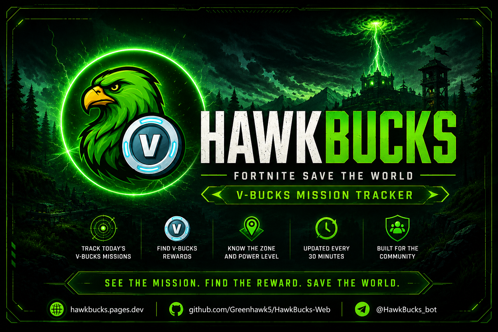
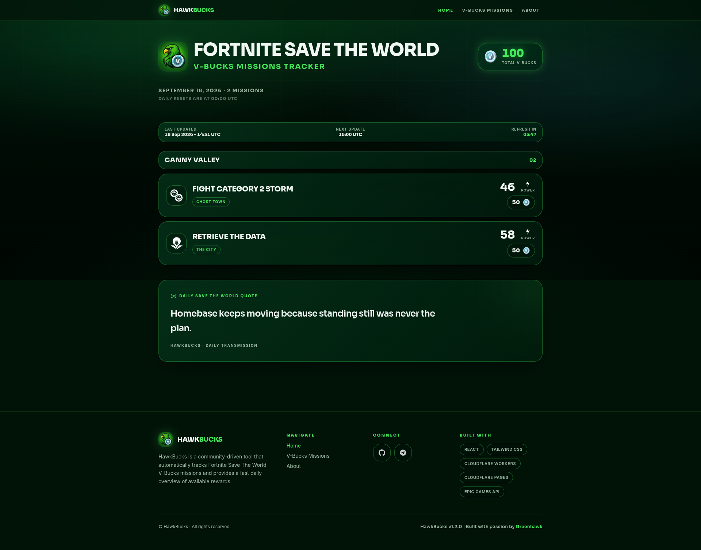
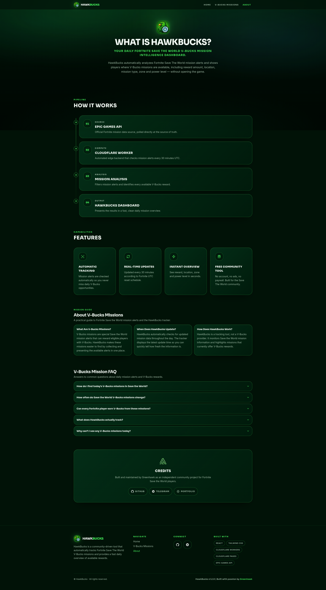
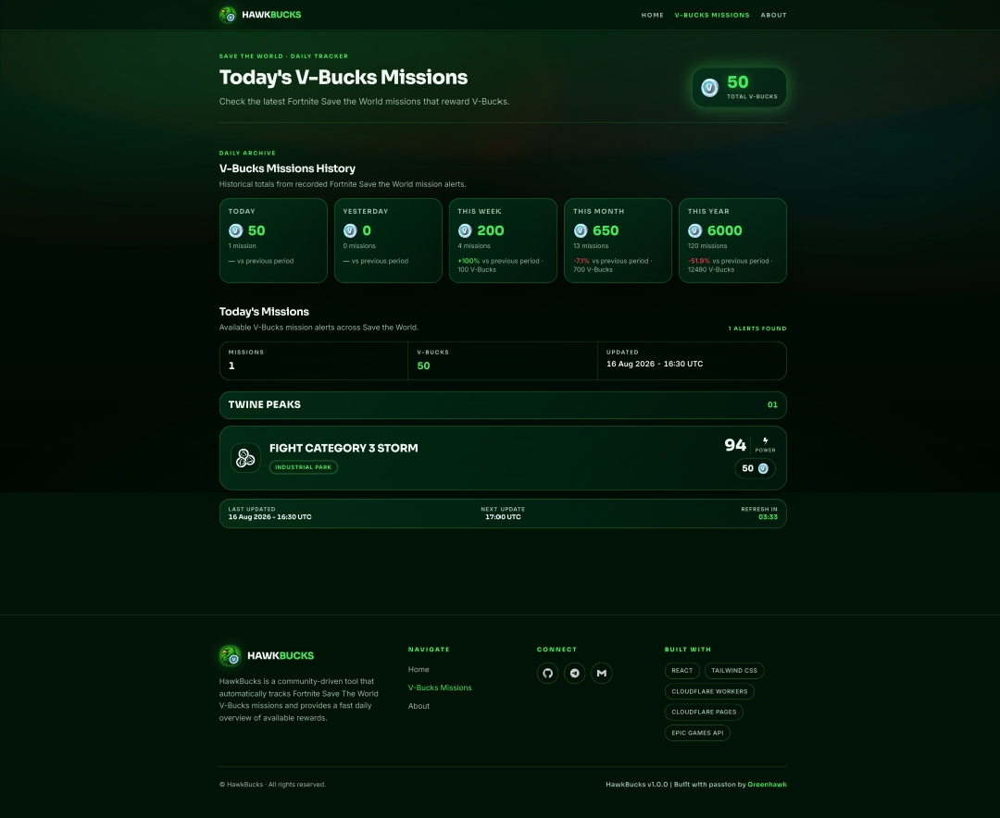

<div align="center">

<!-- ========================================================= -->
<!-- HERO IMAGE                                                -->
<!-- Replace this image after creating the final project hero. -->
<!-- ========================================================= -->



<br />

# HawkBucks

### Fortnite Save The World V-Bucks Mission Tracker

A modern community tool for discovering today's  
**V-Bucks missions in Fortnite: Save The World.**

<br />

<p>
  <a href="#-overview">Overview</a>
  &nbsp;&nbsp;•&nbsp;&nbsp;
  <a href="#-features">Features</a>
  &nbsp;&nbsp;•&nbsp;&nbsp;
  <a href="#-screenshots">Screenshots</a>
  &nbsp;&nbsp;•&nbsp;&nbsp;
  <a href="#-architecture">Architecture</a>
  &nbsp;&nbsp;•&nbsp;&nbsp;
  <a href="#-installation">Installation</a>
</p>

<br />


</div>

---

## 🌿 Overview

**HawkBucks** is a community-driven web application built around one simple goal:

> **Find today's Fortnite Save The World missions that reward V-Bucks — quickly and without unnecessary information.**

Instead of manually searching through mission data, HawkBucks processes the available Fortnite mission information, identifies missions containing V-Bucks rewards, resolves their mission type, area, zone and Power Level, and presents everything through a clean gaming-focused interface.

The project combines a modern responsive frontend with a lightweight backend worker responsible for retrieving and processing mission data.

The result is a simple experience:

**Open HawkBucks → Check today's missions → Find the V-Bucks → Play.**

HawkBucks also keeps a persistent daily mission history in Cloudflare D1 and exposes that history through the V-Bucks Missions dashboard. The current system provides Today, Yesterday, the current Monday-Sunday UTC calendar week, the current UTC calendar month, and the current UTC calendar year with previous-period comparisons.

The daily quote system is fully deterministic: a static pool of 365 unique quotes is mapped to UTC dates and stored in D1, so the same date always produces the same quote without requiring an external AI generation service.

---

## 🎯 Why HawkBucks?

Fortnite: Save The World periodically contains missions that reward players with V-Bucks.

Finding these missions manually can be inconvenient, especially when there are many missions available across different areas and difficulty levels.

HawkBucks focuses entirely on this problem.

### The experience is designed around three questions:

**Are there V-Bucks missions today?**

**Where are they?**

**What Power Level do I need?**

Everything else stays out of the way.

---

# ✨ Features

## 💎 V-Bucks Mission Detection

HawkBucks automatically analyzes the available mission data and identifies missions that contain V-Bucks rewards.

Each detected mission provides the important information needed by the player:

- V-Bucks reward amount
- Mission type
- Area
- Zone
- Power Level

---

## ⚡ Fast Mission Overview

The website is designed so that the user can understand the current situation within seconds.

The main dashboard prioritizes:

1. **V-Bucks reward**
2. **Area**
3. **Mission**
4. **Power Level**
5. **Zone**

No unnecessary dashboards or complicated navigation.

---

## 🌍 Multiple Mission Areas

Mission information is resolved across the major Save The World progression areas, including:

- Stonewood
- Plankerton
- Canny Valley
- Twine Peaks

---

## 🗺️ Mission & Zone Resolution

Raw Fortnite mission data is not always directly suitable for human-readable presentation.

HawkBucks includes resolution and mapping logic for:

- Mission types
- Mission categories
- Power Levels
- Zone themes
- Area names
- Special zone variants

This allows raw mission information to become useful player-facing information.

---

## 🌐 Multi-language Data Support

The project includes localized mission and area data.

Supported localization data currently includes languages such as:

- English
- Arabic
- German
- Spanish
- French
- Italian
- Japanese
- Korean
- Polish
- Portuguese
- Russian
- Turkish
- Chinese

The localization layer is designed so additional languages can be added without rewriting the mission-processing logic.

---

## 📱 Responsive Gaming Interface

The HawkBucks frontend is designed for both desktop and mobile devices.

The interface uses:

- Dark gaming aesthetics
- Emerald / neon-green accents
- Glass-inspired surfaces
- High-contrast typography
- Responsive layouts
- Compact mission cards
- Mobile-friendly navigation

The goal is to make the website feel closer to a **premium gaming command center** than a traditional dashboard.

---

## 🔄 Automatic Updates

Mission information is designed around the Fortnite mission rotation.

The application can display:

- Last update
- Next update
- Current mission status
- Current V-Bucks total

This allows users to quickly determine whether they should check back after the next rotation.

---

# 🖥️ Screenshots

## Home


<p align="center">
  
</p>

The Home page is the primary mission dashboard.

It focuses on the current V-Bucks status and presents available missions in an easy-to-scan format.

---

## About


<p align="center">
  
</p>

The About page explains the project, its purpose and the technology behind HawkBucks.

---

## V-Bucks Missions


<p align="center">
  
</p>

The V-Bucks Missions page combines the current mission tracker with historical V-Bucks totals, mission counts, and previous-period comparisons.

It provides summaries for:

- Today
- Yesterday
- Current calendar week (API field: `last7Days`)
- Current calendar month (API field: `last30Days`)
- This Year

---

# 🧠 How It Works

At a high level, HawkBucks follows this pipeline:

```text
                 Fortnite / Epic Games
                         │
                         ▼
                Mission World Data
                         │
                         ▼
                HawkBucks Worker
                         │
              ┌──────────┴──────────┐
              │                     │
              ▼                     ▼
        Mission Filtering       Data Resolution
              │                     │
              └──────────┬──────────┘
                         │
                         ▼
                  V-Bucks Missions
                         │
                         ▼
                 HawkBucks Frontend
                         │
                         ▼
                       User
```

The Worker retrieves and processes mission data, caches the current result in KV, persists daily snapshots in D1, and exposes normalized API responses.

The frontend reads the missions, history, and daily quote through the Worker API.

---

# 🏗️ Architecture

HawkBucks is divided into two primary application layers.

## Frontend

The frontend provides the user-facing experience.

It is built around:

- React
- TypeScript
- Vite
- Tailwind CSS
- TanStack Router
- TanStack Query
- Radix UI
- Lucide Icons

The current production routes are:

- `/` — Home dashboard
- `/about` — About page and FAQ
- `/vbucks-missions` — V-Bucks mission tracker and history dashboard

The frontend uses `frontend/src/services/missions.api.ts` as the API seam between the UI and the Worker.

The current repository contains the frontend under:

```text
/frontend
```

The frontend is designed as a reusable component-based application rather than a single monolithic page.

---

## Worker

The backend processing layer lives under:

```text
/worker
```

The Worker is implemented as a Cloudflare Worker and contains the mission-processing, caching, history, quote, and API logic.

Its responsibilities include:

- Authenticating with Epic Games
- Retrieving Fortnite world information
- Detecting V-Bucks mission alerts
- Resolving mission types
- Resolving Power Levels
- Resolving mission zones
- Handling localization
- Caching the current mission response in Cloudflare KV
- Persisting daily mission snapshots in Cloudflare D1
- Serving the frontend through the public Worker API
- Maintaining the deterministic daily quote record

Worker configuration is managed through Wrangler and `worker/wrangler.toml`.

---

# 🧩 Mission Processing

The mission-processing pipeline can be summarized as:

```text
Raw World Data
      │
      ▼
Mission Alerts
      │
      ▼
Find V-Bucks Rewards
      │
      ▼
Match Mission Tile
      │
      ▼
Resolve Mission Type
      │
      ▼
Resolve Power Level
      │
      ▼
Resolve Zone
      │
      ▼
Localized Mission Result
```

For example, raw mission information can eventually become:

```text
50 V-Bucks

Canny Valley
Fight Category 2 Storm

Power Level: 52

Desert
```

This transformation is one of the core purposes of the HawkBucks backend.

---

# 🗃️ Data & History

HawkBucks uses Cloudflare KV and D1 for different responsibilities.

| Service | Purpose |
|---|---|
| Cloudflare KV (`HAWKBUCKS_CACHE`) | Current mission response cache and bounded legacy migration support |
| Cloudflare D1 (`DB`) | Persistent daily mission history and daily quote records |

The D1 `mission_history` table stores one record per UTC date containing the total V-Bucks, mission count, serialized missions, and timestamps.

The history dashboard calculates:

- Today
- Yesterday
- Current calendar week (API field: `last7Days`)
- Current calendar month (API field: `last30Days`)
- This Year

It also compares those periods with their previous equivalent periods. When a comparison baseline is unavailable or zero, no invalid percentage is produced.

Migration `0001_history_and_quotes.sql` creates the history and quote tables. Migrations `0002_reference_history_seed.sql` and `0003_reference_mission_counts.sql` provide idempotent reference/bootstrap data and are not live mission observations.

---

# 💬 Daily Quote System

HawkBucks no longer generates daily quotes through Gemini or another external AI service.

The Worker uses `worker/quote-pool.js`, which contains **365 unique static quotes**. The quote for each UTC date is selected deterministically from the pool using:

```text
epoch = 2025-01-01T00:00:00Z
elapsedDays = UTC days since epoch
quoteIndex = positiveModulo(elapsedDays, 365)
```

The selected quote is stored in the D1 `daily_quotes` table. Repeated Worker executions on the same UTC date reuse the existing record, so the quote remains stable throughout the day.

The pool cycles after 365 days.

---

# 🎨 Design Philosophy

HawkBucks follows a specific visual direction.

### Dark

The interface uses a deep dark background designed for comfortable viewing in gaming environments.

### Emerald

Green and emerald tones represent the HawkBucks identity and provide the primary visual accent.

### Futuristic

Soft glow effects, glass-inspired surfaces and subtle borders create a modern gaming atmosphere.

### Focused

The UI avoids unnecessary information.

The user should immediately understand:

> **Today's V-Bucks status.**

---

# 🛠️ Technology Stack

## Frontend

| Technology | Purpose |
|---|---|
| React | UI framework |
| TypeScript | Type safety |
| Vite | Development & build tooling |
| Tailwind CSS | Styling |
| TanStack Router | Routing |
| TanStack Query | Data fetching & state |
| Radix UI | Accessible UI primitives |
| Lucide React | Icons |

---

## Backend / Worker

| Technology | Purpose |
|---|---|
| JavaScript | Worker and mission-processing logic |
| Cloudflare Workers | Backend runtime |
| Cloudflare KV | Current mission response cache |
| Cloudflare D1 | Mission history and daily quote persistence |
| Wrangler | Cloudflare development and deployment tooling |

---

# 📁 Project Structure

```text
HawkBucks-Web/
│
├── frontend/
│   │
│   ├── public/
│   │
│   ├── src/
│   │   ├── components/
│   │   ├── pages/
│   │   ├── routes/
│   │   ├── lib/
│   │   └── ...
│   │
│   ├── package.json
│   ├── vite.config.ts
│   ├── tsconfig.json
│   ├── tailwind.config.*
│   └── README.md
│
├── worker/
│   │
│   ├── assets/
│   ├── index.js
│   ├── localization.json
│   ├── package.json
│   ├── wrangler.toml
│   └── README.md
│
├── docs/
│   └── screenshots/
│       ├── hawkbucks-header.png
│       ├── home.png
│       ├── about.png
│       └── v-bucks-missions.png
│
├── .github/
│   ├── ISSUE_TEMPLATE/
│   │   ├── bug_report.yml
│   │   ├── feature_request.yml
│   │   └── config.yml
│   ├── workflows/
│   │   └── ci.yml
│   ├── CODEOWNERS
│   ├── dependabot.yml
│   └── PULL_REQUEST_TEMPLATE.md
│
├── .gitignore
├── .gitattributes
├── CHANGELOG.md
├── CITATION.cff
├── CODE_OF_CONDUCT.md
├── CONTRIBUTING.md
├── LICENSE
├── NOTICE.md
├── REPOSITORY_HARDENING.md
├── SECURITY.md
├── SUPPORT.md
└── README.md
```

> The structure above represents the major project layers. Individual source files may evolve as development continues.

---

# 🌐 API

The frontend communicates with the Cloudflare Worker through three public endpoints:

```text
GET /api/missions
GET /api/history
GET /api/quote
```

The production Worker base URL is:

```text
https://hawkbucks-worker.hawkbucksbot.workers.dev
```

### `/api/missions`

Returns the current cached mission response, including:

- `status`
- `lastUpdated`
- `totalVbucks`
- normalized mission data

If current mission data is unavailable, the Worker returns a safe unavailable response.

### `/api/history`

Returns D1-backed historical summaries for:

- Today
- Yesterday
- Current calendar week (`last7Days`, Monday-Sunday UTC)
- Current calendar month (`last30Days`, UTC)
- This Year

### `/api/quote`

Returns the current UTC day's deterministic quote from the 365-quote pool.

---

# ⏱️ Automatic Updates

The Worker is configured with a Cron Trigger:

```text
*/30 * * * *
```

This means the Worker runs every 30 minutes to refresh mission data and perform scheduled persistence work.

The daily quote does **not** change every 30 minutes. Once the quote for a UTC date exists in D1, repeated Worker runs reuse that record.

---

# 🧰 Repository & Community Files

HawkBucks also includes a set of repository-level files designed to make the project easier to maintain, contribute to, secure and release.

| File | Purpose |
|---|---|
| `LICENSE` | Defines the GreenHawk Non-Commercial License and the permitted and prohibited uses of the project. |
| `SECURITY.md` | Explains how to report security vulnerabilities privately and responsibly. |
| `CONTRIBUTING.md` | Contribution workflow, development guidelines and Pull Request expectations. |
| `CODE_OF_CONDUCT.md` | Community standards for respectful and constructive participation. |
| `SUPPORT.md` | Guidance for getting technical help and reporting reproducible problems. |
| `CHANGELOG.md` | Human-readable history of project releases and notable changes. |
| `CITATION.cff` | Standard metadata for citing HawkBucks in other projects or publications. |
| `NOTICE.md` | Project trademark, affiliation and third-party software notices. |
| `REPOSITORY_HARDENING.md` | Security checklist for GitHub, secrets, Cloudflare and releases. |
| `.gitignore` | Prevents local secrets, credentials, build artifacts and environment files from being committed. |
| `.gitattributes` | Keeps repository text normalization and binary assets consistent. |
| `.github/CODEOWNERS` | Defines the default repository code owner. |
| `.github/dependabot.yml` | Enables automated dependency update checks for supported project components. |
| `.github/PULL_REQUEST_TEMPLATE.md` | Standardizes Pull Request descriptions and testing checklists. |
| `.github/ISSUE_TEMPLATE/` | Provides structured templates for bug reports and feature requests. |
| `.github/workflows/ci.yml` | Runs automated frontend and worker validation on pushes and Pull Requests. |

These files are intentionally kept separate from application code so the repository remains easy to navigate while still providing professional project-maintenance infrastructure.

---

# 🔐 Repository Security

Security is particularly important because the Worker communicates with authenticated Epic Games services.

HawkBucks therefore follows a few basic repository rules:

- Real Epic Games credentials must never be committed.
- Device Auth secrets must never be committed.
- Private webhook URLs and API tokens must remain outside source control.
- Production credentials should be stored as deployment secrets/environment configuration.
- If a credential is exposed, it should be revoked and regenerated immediately.
- Security vulnerabilities should be reported privately rather than through a public GitHub Issue.

For the complete policy, see [`SECURITY.md`](SECURITY.md).

For the repository hardening checklist, see [`REPOSITORY_HARDENING.md`](REPOSITORY_HARDENING.md).

---

# 🤝 Contributing & Community

HawkBucks includes dedicated contribution and community guidelines:

- [`CONTRIBUTING.md`](CONTRIBUTING.md) — development workflow and Pull Request guidelines
- [`CODE_OF_CONDUCT.md`](CODE_OF_CONDUCT.md) — community standards
- [`SUPPORT.md`](SUPPORT.md) — help and troubleshooting guidance
- [`CHANGELOG.md`](CHANGELOG.md) — project change history

GitHub also provides structured templates for:

- Bug reports
- Feature requests
- Pull Requests

This keeps project discussions focused and makes contributions easier to review.

---

# 🔄 Continuous Integration

Every push to `main` and every Pull Request targeting `main` can be checked by the repository's GitHub Actions workflow.

The CI pipeline is intended to validate:

1. Frontend dependency installation
2. Frontend linting when configured
3. Frontend production build
4. Worker dependency installation
5. Wrangler dry-run validation

Workflow definition:

```text
.github/workflows/ci.yml
```

The purpose of CI is to catch common build and configuration problems before they reach production.

---

# 📦 Dependency Maintenance

HawkBucks includes Dependabot configuration for:

- Frontend npm dependencies
- Worker npm dependencies
- GitHub Actions dependencies

Configuration:

```text
.github/dependabot.yml
```

Dependency updates should still be reviewed and tested before being merged, especially when they affect authentication, Cloudflare Workers, mission parsing or the production build.

---

# 🚀 Installation

## Requirements

Before running HawkBucks locally, make sure you have:

- Git
- Node.js
- npm

The current frontend and Worker package configurations should be used as the source of truth for the supported Node.js version.

The project is split into two independently installable applications:

- `/frontend`
- `/worker`

---

## Clone the repository

```bash
git clone https://github.com/Greenhawk5/HawkBucks-Web.git
cd HawkBucks-Web
```

---

# 💻 Frontend Setup

Navigate to the frontend:

```bash
cd frontend
```

Install dependencies:

```bash
npm ci
```

Set `VITE_API_BASE_URL` in `frontend/.env` only when you need to use a different Worker endpoint. Otherwise the frontend uses the configured production Worker endpoint.

Start the development server:

```bash
npm run dev
```

---

## Production Build

To create a production build:

```bash
npm run build
```

To preview the production build locally:

```bash
npm run preview
```

Run linting with:

```bash
npm run lint
```

Formatting can be checked with:

```bash
npx prettier --check src
```

---

# ⚙️ Worker Setup

Navigate to the worker:

```bash
cd worker
```

Install dependencies:

```bash
npm ci
```

For local Worker development:

```bash
npx wrangler dev --local --config wrangler.toml
```

For local D1 migrations:

```bash
npx wrangler d1 migrations apply hawkbucks-data --local --config wrangler.toml
```

The Worker requires Epic authentication values to be configured as deployment secrets.

### Important

**Never commit real Epic Games credentials, Device Auth secrets or private webhook URLs to a public repository.**

The current Worker does not require `GEMINI_API_KEY` for the daily quote system.

---

# 🔐 Security

HawkBucks interacts with authenticated Epic Games services.

For that reason, sensitive values must remain private.

Never expose:

- Epic Games account IDs
- Device IDs
- Device Auth secrets
- API tokens
- Webhook URLs
- Other private credentials

The current Worker authentication configuration uses deployment secrets rather than frontend environment variables.

If credentials are accidentally exposed, revoke and regenerate them immediately.

For the complete policy, see [`SECURITY.md`](SECURITY.md).

---

# 🌐 Deployment

The production architecture uses:

- Frontend: Vite-built React application deployed as the web interface
- Backend: Cloudflare Worker
- Current mission cache: Cloudflare KV
- Persistent history and daily quotes: Cloudflare D1

Deploy the Worker with:

```bash
cd worker
npx wrangler deploy --config wrangler.toml
```

Apply reviewed production D1 migrations with:

```bash
npx wrangler d1 migrations apply hawkbucks-data --remote --config wrangler.toml
```

The repository CI performs validation and a Wrangler dry run; it does not deploy production automatically.

Production Epic credentials must be configured through Cloudflare Worker Secrets.

---

# 🧭 Current Project Status

HawkBucks has evolved beyond a simple mission viewer.

### Current

- [x] HawkBucks web interface
- [x] Home page
- [x] About page
- [x] V-Bucks Missions history dashboard
- [x] V-Bucks reward detection
- [x] Mission type resolution
- [x] Power Level resolution
- [x] Zone resolution
- [x] Localization foundation
- [x] Responsive design
- [x] Cloudflare Worker API
- [x] Cloudflare KV mission caching
- [x] Cloudflare D1 mission history
- [x] Historical period comparisons
- [x] Deterministic 365-quote daily system
- [x] SEO metadata and sitemap/robots infrastructure

---

# 🤖 Future Integrations

The project architecture keeps the mission-processing layer separated from the frontend so additional HawkBucks experiences can be built around the same normalized data in the future.

Potential integrations may include additional community-facing clients or notification services, but these are not part of the current production application.

---

# 📊 Example Mission

A typical HawkBucks mission result can look like:

```text
┌───────────────────────────────────────┐
│                                       │
│  50 V-Bucks                           │
│                                       │
│  Canny Valley                         │
│  Fight Category 2 Storm               │
│                                       │
│  Power Level: 52                      │
│  Zone: Desert                         │
│                                       │
└───────────────────────────────────────┘
```

The goal is not to overwhelm the player with raw API data.

The goal is to turn complex mission information into something immediately useful.

---

# 🦅 About the Name

**HawkBucks** combines the project's hawk-inspired visual identity with its primary purpose:

**V-Bucks mission tracking.**

The hawk represents:

- Vision
- Speed
- Precision
- Awareness

Which matches the project's purpose:

> **See the mission. Find the reward. Play.**

---

# 🤝 Contributing

Contributions, suggestions and improvements are welcome.

For the complete development workflow, coding guidelines, testing checklist and Pull Request process, see:

[`CONTRIBUTING.md`](CONTRIBUTING.md)

In short:

1. Fork the repository.
2. Create a focused feature or fix branch.
3. Make and test your changes.
4. Review the final diff for secrets and unrelated changes.
5. Commit with a clear message.
6. Open a Pull Request using the repository template.

Example:

```bash
git checkout -b feature/my-feature

git add .

git commit -m "feat: add my feature"

git push origin feature/my-feature
```

---

# 🐛 Issues & Suggestions

Found a bug or have an idea?

Please use the GitHub Issue templates where possible:

- **Bug Report** for reproducible problems
- **Feature Request** for proposed improvements

For security vulnerabilities, do **not** open a public issue. Follow [`SECURITY.md`](SECURITY.md).

---

# 📜 License

HawkBucks is available under the **GreenHawk Non-Commercial License v1.0**.

HawkBucks is a source-available project. Its source code is publicly
accessible for personal, educational, research, testing, and experimental
use. Commercial use, monetization, resale, paid hosting, commercial
redistribution, and similar commercial use require prior written permission
from GreenHawk.

See [`LICENSE`](LICENSE) for the complete license text.

Additional project and third-party notices are available in [`NOTICE.md`](NOTICE.md).

---

# ⚠️ Disclaimer

HawkBucks is an independent community project.

It is **not affiliated with, endorsed by, or sponsored by Epic Games or Fortnite**.

Fortnite and V-Bucks are trademarks of Epic Games, Inc.

HawkBucks uses publicly accessible game-related information and services to provide a community-focused mission tracking experience.

---

# 💚 Credits

### HawkBucks Project

Designed and developed as an independent community project for Fortnite: Save The World players.

Special thanks to the open-source community and everyone contributing ideas, testing the application and helping improve HawkBucks.

For repository policies and project maintenance information, see:

[`SECURITY.md`](SECURITY.md) ·
[`CONTRIBUTING.md`](CONTRIBUTING.md) ·
[`CODE_OF_CONDUCT.md`](CODE_OF_CONDUCT.md) ·
[`SUPPORT.md`](SUPPORT.md) ·
[`CHANGELOG.md`](CHANGELOG.md)

---

<div align="center">

### Built for Save The World players.

**Find the V-Bucks.  
Track the missions.  
Never miss a reward.**

<br />


<br /><br />

**HawkBucks**

*Fortnite Save The World V-Bucks Mission Tracker*

</div>
